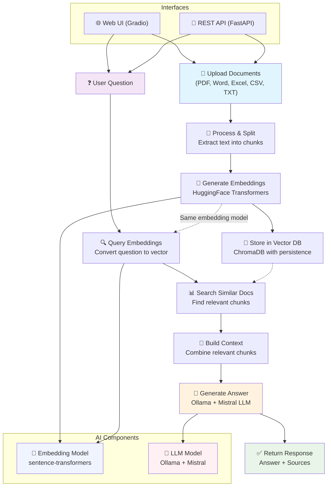

# 🏗️ AI Architecture Patterns Demo

A comprehensive demonstration of **multiple AI architecture patterns** running entirely locally. This application showcases different approaches to AI implementation, featuring **RAG (Retrieval-Augmented Generation)** and **Direct LLM** patterns with clean architecture, proper error handling, and comprehensive logging.

## ✨ Features

### 🏗️ Architecture Patterns
- 📚 **RAG Pattern**: Retrieval-Augmented Generation with document context
- 🤖 **Direct LLM Pattern**: Pure language model interaction without retrieval
- 🔄 **Pattern Comparison**: Side-by-side demonstration of different approaches
- 🎛️ **Model Switching**: Choose between different Ollama models for each pattern

### 🛠️ Technical Features
- 🏠 **Fully Local**: No external API calls, complete privacy
- 🧠 **Smart AI**: Uses Ollama with Mistral for intelligent responses
- 📚 **Vector Storage**: Persistent local vector database with Chroma
- 📁 **Multi-Format Support**: Upload CSV, Excel, PDF, Word, and text files
- 🎨 **Modern UI**: Beautiful Gradio interface with pattern-specific tabs
- 🚀 **REST API**: Full FastAPI backend with multiple endpoints
- 🔧 **Production Ready**: Proper logging, error handling, and service architecture
- 📊 **Statistics**: Monitor your document store and system status

## 📁 Supported File Formats

| Format | Extension | Description |
|--------|-----------|-------------|
| 📊 **CSV** | `.csv` | Comma-separated values - tabular data |
| 📈 **Excel** | `.xlsx`, `.xls` | Microsoft Excel spreadsheets |
| 📄 **PDF** | `.pdf` | Portable Document Format documents |
| 📝 **Word** | `.docx` | Microsoft Word documents |
| 📃 **Text** | `.txt` | Plain text files |

## 🏗️ Architecture

### System Architecture Diagram



### File Structure

```
├── app/
│   ├── __init__.py          # Package initialization
│   ├── main.py              # FastAPI application
│   ├── models.py            # Pydantic data models
│   ├── rag_service.py       # Core RAG business logic
│   ├── file_processor.py    # File processing service
│   └── gradio_interface.py  # Gradio web interface
├── data/                    # Local data storage
│   └── chroma_db/          # Vector database
├── requirements.txt         # Python dependencies
├── run.sh                  # Application launcher
└── README.md               # This file
```

### Technology Stack

- **🧠 LLM**: Ollama with multiple model support (Mistral, Llama2, CodeLlama, Phi, etc.)
- **🗄️ Vector Store**: Chroma (local storage with persistence)
- **🔤 Embeddings**: Sentence Transformers (all-MiniLM-L6-v2)
- **📁 File Processing**: Pandas, PyPDF2, python-docx, openpyxl
- **🌐 API**: FastAPI with automatic OpenAPI documentation
- **🎨 Frontend**: Gradio with modern UI components and model selection
- **📦 Architecture**: Clean service layer with dependency injection

### Supported Models

The application supports multiple Ollama models:
- **mistral** - Default, balanced performance
- **llama2** - Meta's Llama 2 model
- **codellama** - Specialized for code generation
- **phi** - Microsoft's efficient model
- **neural-chat** - Optimized for conversations
- **starling-lm** - High-quality responses
- **orca-mini** - Compact but capable
- **vicuna** - Strong general-purpose model

*Note: Models need to be downloaded via Ollama before use. The application will attempt to use the selected model and fall back to the default if unavailable.*

## 🚀 Quick Start

### Prerequisites

- **Python 3.11+**
- **Ollama** (for local LLM inference)

### Installation

1. **Install Ollama**:
   ```bash
   # Visit https://ollama.ai/download
   # Or on macOS with Homebrew:
   brew install ollama
   ```

2. **Clone and Setup**:
   ```bash
   git clone <your-repo-url>
   cd <your-repo-directory>
   chmod +x run.sh
   ```

3. **Run the Application**:
   ```bash
   ./run.sh
   ```

The script will automatically:
- ✅ Check for Ollama installation
- 📥 Download the Mistral model if needed
- 🐍 Create a Python virtual environment
- 📦 Install all dependencies (including file processing libraries)
- 🔍 Verify all installations
- 🚀 Start both FastAPI and Gradio interfaces

## 🌐 Interfaces

### 🎨 Gradio Web Interface (Port 7860)
Access the user-friendly interface at **http://localhost:7860**

**Architecture Pattern Tabs:**
- 📚 **RAG Pattern - Document Management**: 
  - Upload text documents manually
  - Upload files (CSV, Excel, PDF, Word, TXT)
  - View processing statistics
  - Clear all documents
- 📚 **RAG Pattern - Query System**: Ask questions about your documents with intelligent responses
- 🤖 **Direct LLM Pattern**: Chat directly with Mistral without document context
- ℹ️ **About Architecture Patterns**: Learn about different AI patterns and their use cases

### 🔧 FastAPI REST API (Port 8000)
Access the API documentation at **http://localhost:8000/docs**

**Endpoints:**
- `POST /documents` - Add text documents to the vector store
- `POST /upload-file` - Upload and process files (CSV, Excel, PDF, Word, TXT)
- `GET /supported-formats` - Get list of supported file formats
- `GET /available-models` - Get list of available Ollama models
- `POST /query` - Query the RAG system (with document context, default model)
- `POST /query-with-model` - Query the RAG system with specific model
- `POST /llm-query` - Query the LLM directly (without document context, default model)
- `POST /llm-query-with-model` - Query the LLM directly with specific model
- `GET /stats` - Get vector store statistics
- `DELETE /documents` - Clear all documents
- `GET /health` - Health check

**Example API Usage:**
```bash
# Upload a file
curl -X POST "http://localhost:8000/upload-file" \
  -H "accept: application/json" \
  -H "Content-Type: multipart/form-data" \
  -F "file=@document.pdf"

# Add text documents
curl -X POST "http://localhost:8000/documents" \
  -H "Content-Type: application/json" \
  -d '{"documents": ["Your document content here"]}'

# Query the RAG system (with document context)
curl -X POST "http://localhost:8000/query" \
  -H "Content-Type: application/json" \
  -d '{"text": "What is this document about?"}'

# Query the LLM directly (without document context)
curl -X POST "http://localhost:8000/llm-query" \
  -H "Content-Type: application/json" \
  -d '{"text": "Explain quantum computing"}'

# Query with specific model
curl -X POST "http://localhost:8000/query-with-model" \
  -H "Content-Type: application/json" \
  -d '{"text": "What is this document about?", "model_name": "llama2"}'

# Get available models
curl -X GET "http://localhost:8000/available-models"

# Get supported formats
curl -X GET "http://localhost:8000/supported-formats"
```

## 📁 File Processing Details

### CSV Files
- Extracts column headers and row data
- Converts tabular data to searchable text format
- Preserves data relationships and structure

### Excel Files (.xlsx, .xls)
- Processes multiple sheets
- Extracts headers and data from each sheet
- Maintains sheet organization and data context

### PDF Files
- Extracts text from all pages
- Preserves page structure and organization
- Handles various PDF formats and encodings

### Word Documents (.docx)
- Extracts text from paragraphs
- Processes tables and structured content
- Maintains document formatting context

### Text Files (.txt)
- Supports multiple encodings (UTF-8, Latin-1, CP1252)
- Preserves original text structure
- Handles various text file formats

## 🔧 Configuration

The application can be configured by modifying the `RAGService` initialization in `app/rag_service.py`:

```python
RAGService(
    model_name="mistral",                    # Ollama model name
    embedding_model="all-MiniLM-L6-v2",    # HuggingFace embedding model
    persist_directory="data/chroma_db",     # Vector store location
    chunk_size=1000,                        # Document chunk size
    chunk_overlap=200                       # Chunk overlap for context
)
```

## 🛠️ Development

### Project Structure
- **Service Layer** (`rag_service.py`): Core business logic, isolated from web frameworks
- **File Processing** (`file_processor.py`): Handles multiple file formats
- **API Layer** (`main.py`): FastAPI endpoints with file upload support
- **UI Layer** (`gradio_interface.py`): Modern Gradio interface with file upload
- **Models** (`models.py`): Pydantic models for data validation

### Key Features
- **Multi-Format Support**: Automatic file type detection and processing
- **Lazy Loading**: Components initialize only when needed
- **Error Handling**: Comprehensive error catching and logging
- **Type Safety**: Full type hints throughout the codebase
- **Clean Architecture**: Separation of concerns with dependency injection

## 🔒 Privacy & Security

- **🏠 Local Processing**: All data stays on your machine
- **🔐 No External Calls**: No data sent to external services
- **📁 Persistent Storage**: Documents saved locally in vector database
- **🛡️ Secure**: No API keys or external dependencies required
- **🗑️ Memory Processing**: Files processed in memory, not permanently stored

## 📊 Monitoring

The application includes comprehensive logging and statistics:
- Document count and storage metrics
- File processing success/failure rates
- Model information and status
- Error tracking and debugging information
- Performance monitoring

## 🐛 Troubleshooting

### Common Issues

1. **Ollama not found**: Install Ollama from https://ollama.ai/download
2. **Model download fails**: Check internet connection and Ollama service
3. **File upload errors**: Ensure file format is supported and not corrupted
4. **Memory issues**: Large files may require more RAM
5. **Port conflicts**: Modify ports in the run script if needed

### File Processing Issues

- **PDF extraction fails**: Some PDFs may have complex layouts or be image-based
- **Excel encoding issues**: Try saving as CSV if Excel processing fails
- **Large file timeouts**: Break large files into smaller chunks
- **Unsupported formats**: Convert to supported formats before upload

### Logs
Check the console output for detailed logging information. All components use structured logging for easy debugging.

## 🤝 Contributing

This project follows modern software engineering practices:
- Clean architecture with service layers
- Comprehensive error handling
- Type safety with Pydantic models
- Proper logging and monitoring
- Modular, testable code structure
- Multi-format file processing capabilities

## 📄 License
HIGLY VIBE CODED
